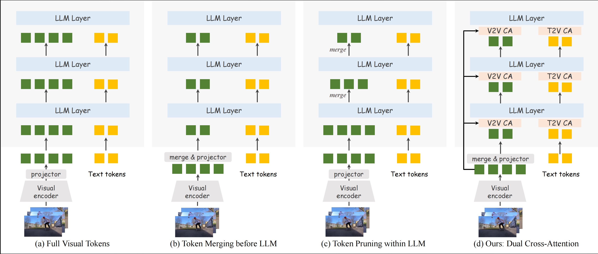
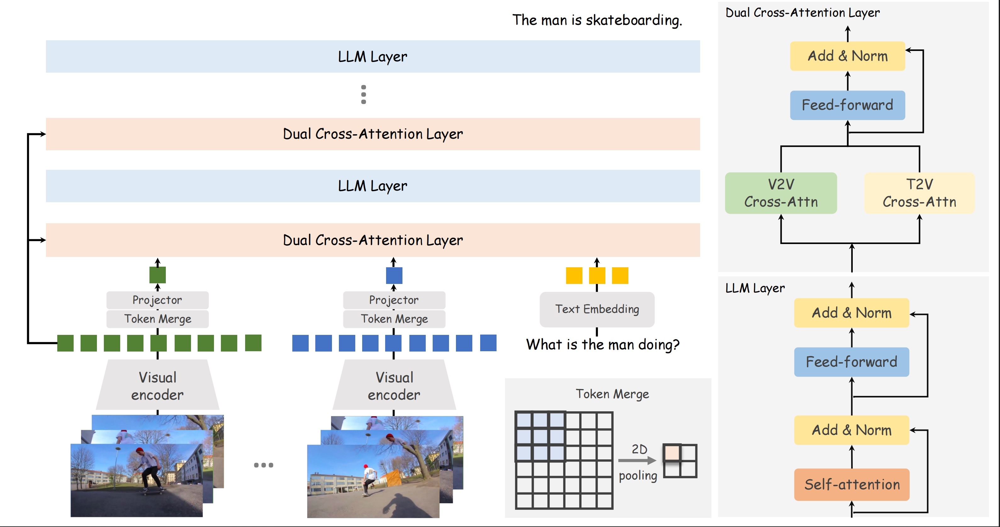

 
<h3>CrossLMM: Decoupling Long Video Sequences from LMMs via   Dual Cross-Attention Mechanisms</h3>

[Shilin Yan](https://scholar.google.com/citations?user=2VhjOykAAAAJ&hl=zh-CN&oi=ao)1†, [Jiaming Han](https://scholar.google.com/citations?user=vgcxKEcAAAAJ&hl=en&oi=ao)2, [Joey Tsai]()3, [Hongwei Xue](https://scholar.google.com/citations?user=k5CJa5YAAAAJ&hl=en&oi=ao), [Rongyao Fang](https://scholar.google.com/citations?user=FtH3CW4AAAAJ&hl=en&oi=ao)2,   [Lingyi Hong](https://scholar.google.com/citations?user=wHh_m_IAAAAJ&hl=en&oi=ao)1, [Ziyu Guo](https://scholar.google.com/citations?user=a6ZGNTEAAAAJ&hl=en&oi=ao)4, [Ray Zhang]()2‡

1Fudan 2CUHK MMLab 3Tsinghua 4CUHK MiuLar Lab 

  

    †Project Leader
    ‡Corresponding author
  

  
<!--    -->
  
<!--    -->

  

  <a href="" target="_blank"><b>Paper</b></a> •
  <a href="#-introduction">Introduction</a> •
  <a href="#-model">Model</a> •
<!--   <a href="#results">Results</a> • -->
<!--   <a href="" target="_blank">🤗 Hugging Face</a> • -->

## 🔥 News
* [2025-05-23]🔥🔥🔥 We release the [paper]()

## 🧠 Introduction

We present  **CrossLMM**, decoupling long video sequences from LMMs via a dual cross-attention mechanism, which substantially reduces visual token quantity with minimal performance degradation. 
Specifically, we first implement a significant token reduction from pretrained visual encoders through a pooling methodology.
Then, within LLM layers, we employ a visual-to-visual cross-attention mechanism, wherein the pooled visual tokens function as queries against the original visual token set. This module enables more efficient token utilization while retaining fine-grained informational fidelity. 
In addition, we introduce a text-to-visual cross-attention mechanism, for which the text tokens are enhanced through interaction with the original visual tokens, enriching the visual comprehension of the text tokens.

## 👀 Model

  

---

### 🚩 Main Innovations

#### 1. 🌟 **Token Reduction via Pooling**
- Significantly compress the number of tokens from pretrained visual encoders for efficient representation.
- Apply a simple pooling strategy to **retain critical visual information** while reducing token count.

#### 2. 🚀 **Visual-to-Visual Cross-Attention**
- Novel architecture design: **Pooled visual tokens act as queries** attending over the original visual token set.
- Enables the model to **capture fine-grained visual details**, maintaining fidelity even under strong token compression.

#### 3. 🔮 **Text-to-Visual Cross-Attention**
- Enhances text token representations through interaction with the original visual tokens.
- Deepens text-visual alignment, offering **richer contextual understanding** for multimodal downstream tasks.

---

### 🔗 **Framework Benefits**

- The **dual attention mechanism** maximizes model efficiency while preserving the ability to handle long-form video content.
- Achieves a strong balance between computational efficiency and fine-grained multimodal understanding, empowering advanced video-language applications.

---

> _This architecture enables efficient and scalable video-text modeling while maintaining state-of-the-art accuracy._

## 🥳 Acknowledgements
We would like to thank [LLAVA-NeXT](https://github.com/LLaVA-VL/LLaVA-NeXT/tree/main), upon which our repo is built.

## 📧 Concat
If you have any question about this project, please feel free to contact tattoo.ysl@gmail.com.
